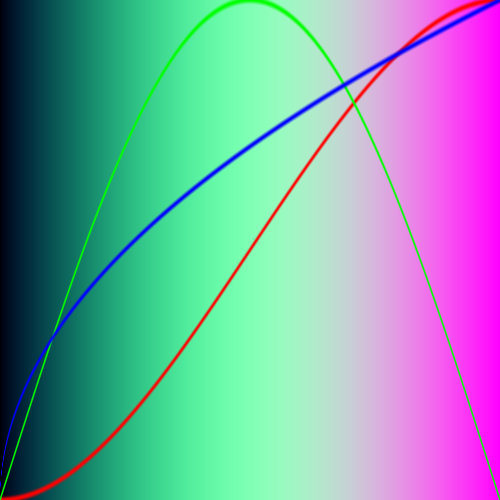
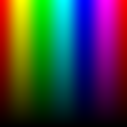
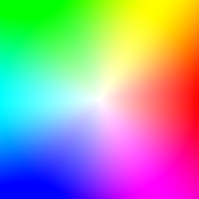
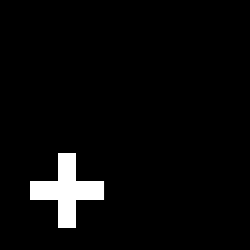
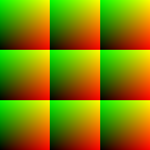
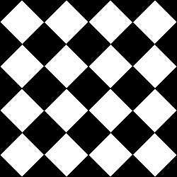
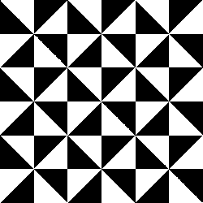
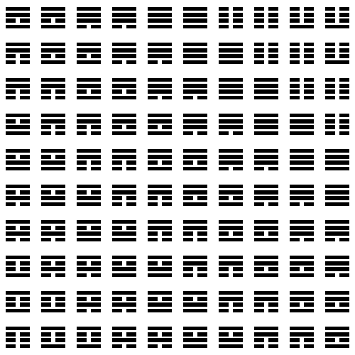

# the book of shaders

电子版书籍代码备份

[电子版原址](https://thebookofshaders.com/?lan=ch)

作者还附加了一个在线实时编辑查看的工具，另附[链接](https://thebookofshaders.com/)

---


## 颜色

在讲到颜色混合**mix**时，作者实现了一部分的缓动实现，可参考[easing.frag](./easing.frag)

同样是颜色混合还有一个例子值得研究，它可视化了两种颜色的混合比例，线段代表比例。

[代码链接](./mix_line.frag)


效果如图




接下来，介绍用色彩空间来讨论颜色，HSB代表色相，饱和度和亮度，代表着极坐标系下的表示方法。作者也给出了HSB和RGB两种不同表示下的转换，[translation_color.frag](./translation_color.frag)

效果如下：




还有一个选择色轮的绘制也是挺有意思的，代码[color_select.frag](./color_select.frag)

效果如图



---


## 形状

首先，用shader画了一个橡塑版的正方形，不能不佩服作者的脑洞，这个例子也是关于运用 step() 函数、逻辑运算和转置坐标的结合。代码在[rectangle.frag](./rectangle.frag)中，效果如图


---

## 2D Matrices 二维矩阵

文章以旋转的加号开始，加号的绘制没太看懂，[cross_shape.frag](./cross_shape.frag)中显示了全过程，效果如下图:



接下就是旋转，坐标变量*mat2, 代码参考[cross_ratation.frag](./cross_ratation.frag),效果如下图：


---

## Patterns 图案


平铺图案的例子：第一个例子比较初级，比如[patterns1.frag](./patterns1),如图所示：



然后很神奇的加上了旋转，这得是厉害了，代码在[patterns_rotation](./patterns_rotation.frag)所示，效果如下图:



另外，实现奇偶行左右偏移不同也是很好的实现

```c
_st.x += step(1., mod(_st.y,2.0)) * 0.5;

// 原理效果等同：
y = mod(x,2.0);
y = mod(x,2.0) < 1.0 ? 0. : 1. ;
y = step(1.0,mod(x,2.0));
```

进化移动版代码实现[patterns_marching_dots.frag](./patterns_marching_dots.frag)


接下来是终极版的，像铺设瓷砖那样显示，代码如[patterns_truchet.frag](./patterns_truchet.frag),效果如图所示



这节最后竟然实现了一个类似易经卦的图像，真真把我震惊到了，代码如

[patterns_iching_01.frag](./patterns_iching_01.frag)效果如图：





